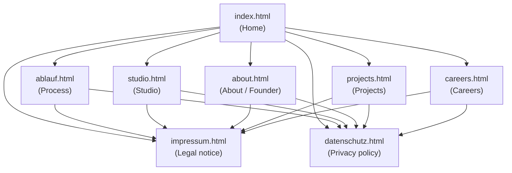
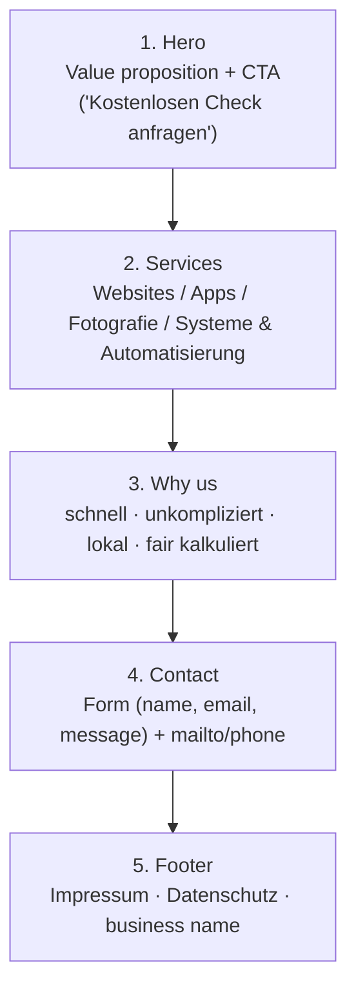

# Armsin Digital Media — Portfolio Site

Client-facing portfolio site for **Armsin Digital Media**, a German digital
products studio. It's the first thing a prospective client sees: local
shops, restaurants, and small businesses across Germany (clients elsewhere
welcome) looking for websites, apps, photography, or systems/automation.

## Goal

Give a potential client, in under a minute, three things:
1. **What we do** — websites, apps, photography, systems/automation.
2. **Why trust us** — fast, unkompliziert, lokal, fair kalkuliert (no fake
   reviews or client logos — there are none yet, and the copy says so).
3. **How to get in touch** — a direct, frictionless path to a first
   conversation (contact form / mailto / phone).

## Tech stack

Plain **HTML / CSS / JS**. No backend, no build step, no npm, no bundler,
no framework — a static site the non-technical owner can safely edit later.

- HTML — one file per page (flat structure, no routing)
- `style.css` — single global stylesheet (retro-terminal / CRT dark theme)
- `assets/js/site.js` — shared vanilla JS (nav, small interactions)
- `assets/js/i18n.js` — DE/EN language switch (see [Language](#language))
- `assets/js/hero-model.js` — Three.js module rendering the homepage hero's
  3D retro-workstation (`assets/models/retro-workstation.glb`)

## Site map



Every page shares the same header/footer chrome; Impressum and
Datenschutz are reachable from every page's footer (German legal
requirement for commercial sites).

## Homepage structure (`index.html`)



## Project structure

```
Armsin Website/
├── index.html              # Home — hero, services, why-us, contact, footer
├── ablauf.html              # Process / how we work
├── studio.html              # Studio overview
├── about.html               # About / founder story
├── projects.html            # Portfolio / project showcase
├── careers.html             # Careers page
├── impressum.html           # Legal notice (required, DE law)
├── datenschutz.html         # Privacy policy
├── style.css                # Global stylesheet (single source of truth)
└── assets/
    ├── js/
    │   ├── site.js          # Shared vanilla JS (nav, interactions)
    │   ├── i18n.js           # DE/EN language switch
    │   └── hero-model.js     # 3D hero model (Three.js)
    ├── models/               # GLB model for the homepage hero
    ├── icons/                # Inline-ready SVG icons (services, process)
    ├── images/               # Process-step SVG illustrations
    ├── logo/                 # Armsin wordmark + icon (light/dark/transparent)
    └── about/                # Founder photo
```

## Design system

Repainted 2026-09-05 into a **retro-terminal / CRT dark theme** (from an
original light "paper" palette — kept for reference in the CSS history and
`.tastemaker/` notes).

| Token        | Value                     | Use                                 |
|--------------|---------------------------|--------------------------------------|
| Background   | `#0A0E0C`                 | Page background, nav/footer chrome  |
| Surface      | `#131E17`                 | Cards, forms, elevated panels       |
| Secondary bg | `#0F1A14`                 | Alternate section backgrounds       |
| Text         | `#D6E8DD`                 | Primary text                        |
| Text (dim)   | `rgba(214,232,221,0.68)`  | Secondary/muted text                |
| Accent       | `#39D97A`                 | CTAs, links, highlights (sparingly) |
| On-accent    | `#06120B`                 | Text on accent fill                 |
| Amber        | `#E0A458`                 | Rare CRT-amber highlight            |

- Headline font: **JetBrains Mono** (Google Fonts)
- Body font: **Inter** (Google Fonts)

Full rationale and contrast math: `.tastemaker/style-lock.md` and
`.tastemaker/decisions.log`.

## Language

German is the source of truth for all copy (the audience is German local
business owners). Code comments may be in English.

A DE/EN toggle in the footer (`assets/js/i18n.js`) switches the UI and
marketing copy to English and remembers the choice via `localStorage`.
English strings live in one dictionary in `i18n.js`, keyed by each
element's `data-i18n` / `data-i18n-aria` / `data-i18n-title` attribute. To
add a translatable string: tag the element in the HTML, add the matching
key in `i18n.js`.

**`impressum.html` and `datenschutz.html` are excluded from translation.**
Their legal body text carries no `data-i18n` attributes and stays German
regardless of the toggle — only the shared nav/footer chrome around it
translates. Do not add `data-i18n` to the legal content itself.

## Editing guide (non-technical)

- **Text**: open the relevant `.html` file, edit the text between tags
  (e.g. `<h1>...</h1>`), save. Don't touch anything in `<` `>` brackets.
- **Colors/fonts**: change values at the top of `style.css` (CSS custom
  properties) — don't edit values scattered throughout the file.
- **Images**: replace files in `assets/images/`, `assets/icons/`, or
  `assets/logo/` keeping the same filename, or update the `src="..."`
  path in the HTML if you rename a file.
- **New page**: copy an existing `.html` file (e.g. `careers.html`) as a
  template to keep the shared header/footer/nav consistent.

## Constraints (do not break these)

- No frameworks, no build tools, no npm — plain HTML/CSS/JS only.
- Mobile-first and responsive — most visitors are on their phone.
- No fake testimonials or client logos (zero real clients yet — copy is
  honest about this).
- No stock "people high-fiving" imagery.
- Tone: direct, practical, no fluff — no overly salesy language.

## Legal

`impressum.html` and `datenschutz.html` contain real legal content
required for a commercial website under German law. Do not replace this
with placeholder text.
