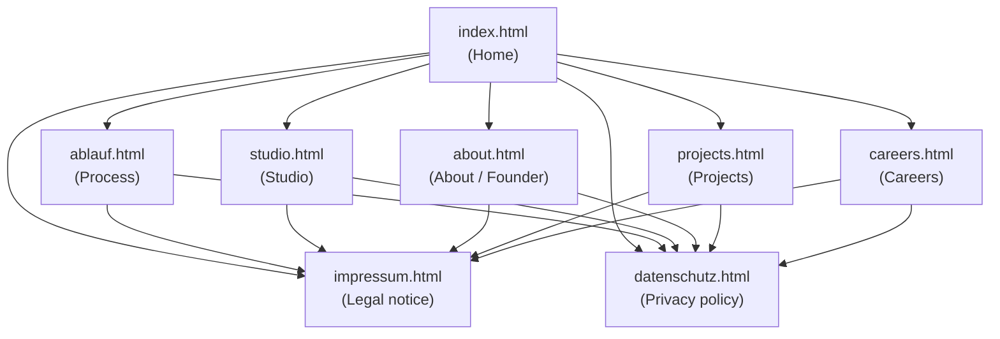
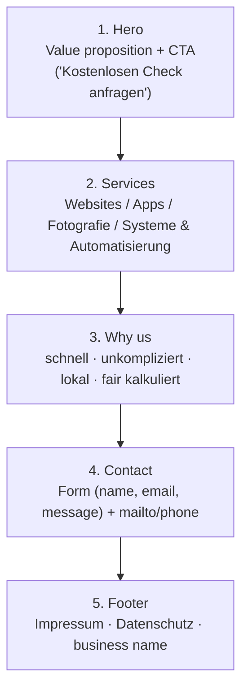

# Armsin Digital Media — Portfolio Site

Client-facing portfolio/landing site for **Armsin Digital Media**, a digital
products studio based in Germany. The site is the first touchpoint for local
shops, restaurants, and small businesses (reach: Germany-wide, open to
clients globally) looking for websites, apps, photography, or systems &
automation work.

## Goal

Give a potential client, in under a minute, three things:
1. **What we do** — websites, apps, photography, systems/automation.
2. **Why trust us** — fast, unkompliziert, lokal, fair kalkuliert (no fake
   reviews or client logos — there are none yet, and the copy says so).
3. **How to get in touch** — a direct, frictionless path to a first
   conversation (contact form / mailto / phone).

No backend, no build step, no frameworks — a static site that a
non-technical person can still safely edit later.

## Tech stack

Plain **HTML / CSS / JS**. No npm, no bundler, no framework.

- HTML — one file per page (flat structure, no routing)
- `style.css` — single global stylesheet (retro-terminal / CRT dark theme)
- `assets/js/site.js` — shared vanilla JS (nav, small interactions)
- `3d Object/` — an isolated Three.js-style module for a 3D visual on the
  homepage/ablauf page (self-contained, not part of the main JS bundle)

## Site map



Every page shares the same header/footer chrome; Impressum and
Datenschutz are reachable from every page's footer (German legal
requirement for commercial sites).

## Homepage structure (`index.html`)



## Project structure

```
Armsin Website/
├── index.html              # Home — hero, services, why-us, contact, footer
├── ablauf.html              # Process / how we work
├── studio.html              # Studio overview
├── about.html               # About / founder story
├── projects.html            # Portfolio / project showcase
├── careers.html             # Careers page
├── impressum.html           # Legal notice (required, DE law)
├── datenschutz.html         # Privacy policy
├── style.css                # Global stylesheet (single source of truth)
├── assets/
│   ├── js/site.js           # Shared vanilla JS (nav, interactions)
│   ├── icons/                # Inline-ready SVG icons (services, process)
│   ├── images/                # Process-step SVG illustrations
│   ├── logo/                  # Armsin wordmark + icon (light/dark)
│   └── about/                 # Founder photo
└── 3d Object/                # Standalone 3D visual module (Three.js-style)
    ├── programming-module.html
    ├── programming-module.js
    └── three-d-stage.js
```

## Design system

Repainted 2026-09-05 into a **retro-terminal / CRT dark theme** (from an
original light "paper" palette — kept for reference in the CSS history and
`.tastemaker/` notes).

| Token          | Value                        | Use                                   |
|----------------|-------------------------------|----------------------------------------|
| Background     | `#0A0E0C`                    | Page background, nav/footer chrome     |
| Surface        | `#131E17`                    | Cards, forms, elevated panels          |
| Secondary bg   | `#0F1A14`                    | Alternate section backgrounds          |
| Text           | `#D6E8DD`                    | Primary text                           |
| Text (dim)     | `rgba(214,232,221,0.68)`      | Secondary/muted text                   |
| Accent         | `#39D97A`                    | CTAs, links, highlights (sparingly)    |
| On-accent      | `#06120B`                    | Text on accent fill                    |
| Amber          | `#E0A458`                    | Rare CRT-amber highlight               |

- Headline font: **JetBrains Mono** (Google Fonts)
- Body font: **Inter** (Google Fonts)

Full rationale and contrast math: `.tastemaker/style-lock.md` and
`.tastemaker/decisions.log`.

## Language

All visible copy is in **German** (target audience: German local business
owners). Code comments may be in English.

## Editing guide (non-technical)

- **Text**: open the relevant `.html` file, edit the text between tags
  (e.g. `<h1>...</h1>`), save. Don't touch anything in `<` `>` brackets.
- **Colors/fonts**: change values at the top of `style.css` (CSS custom
  properties) — don't edit values scattered throughout the file.
- **Images**: replace files in `assets/images/`, `assets/icons/`, or
  `assets/logo/` keeping the same filename, or update the `src="..."`
  path in the HTML if you rename a file.
- **New page**: copy an existing `.html` file (e.g. `careers.html`) as a
  template to keep the shared header/footer/nav consistent.

## Constraints (do not break these)

- No frameworks, no build tools, no npm — plain HTML/CSS/JS only.
- Mobile-first and responsive — most visitors are on their phone.
- No fake testimonials or client logos (zero real clients yet — copy is
  honest about this).
- No stock "people high-fiving" imagery.
- Tone: direct, practical, no fluff — no overly salesy language.

## Legal

`impressum.html` and `datenschutz.html` contain real legal content
required for a commercial website under German law. Do not replace this
with placeholder text.
